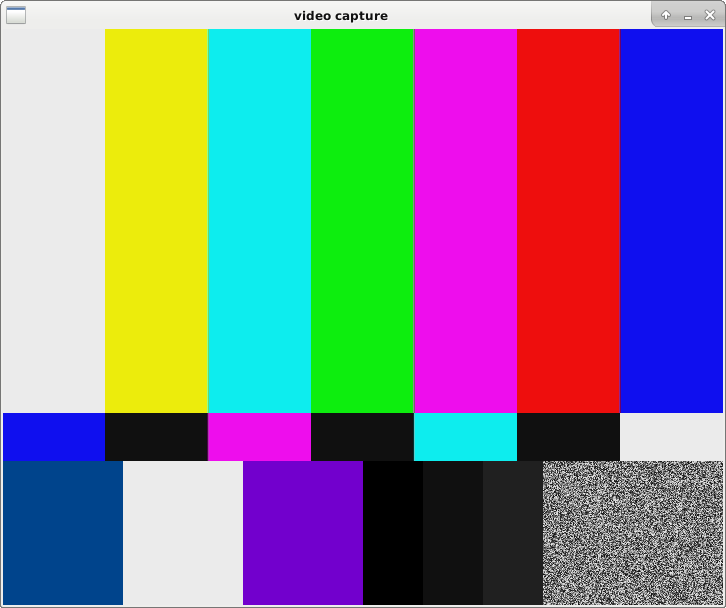
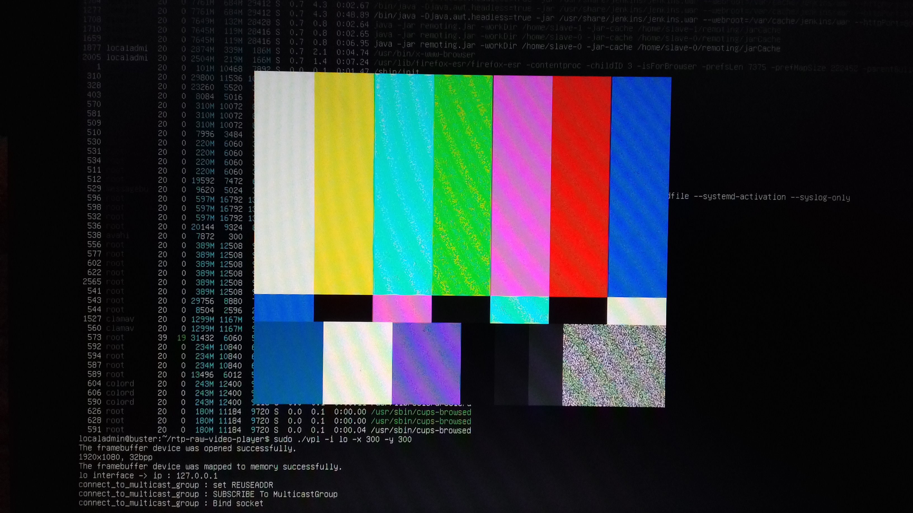

# rtp-raw-video-player

Plays RTP stream with raw video payload.

## Introduction

RAW video can be sent over RTP, the way the video is packed in RTP frames is described in RFC. Video is not encoded and images are streamed as YUV 4:2:0 frames. Each RTP frame contains portions of image scanline. This RTP video payload is rarely used because it consumes a lot of network bandwidth compared to other payloads like h264.

It makes t very easy to write a very simple video player with a few lines of C without any external dependencies. This is the purpose of this project.

The player will output RGB frames either diretly to `/dev/fb0` or to a file which is memory mapped. Another program can mmap the same file and render the video in a window, take snapshots, convert the video to another format ... A demo program displaying the video in a window is provided, it uses SDL2.

As raw video pixels are received in YCbCr color space, the output can be black and white (Y only is used which is very fast) or color. A compilation option (__BLACK_AND_WHITE__) can be used to build a player doing black and white rendering, by default is does color video. The pixel format conversion is pure software which is not very efficient but doesn't add any dependency. 

## Building

### Dependencies

The player itself doesn't have any dependency. SDL2 is required for the demo program rendering the video in a window. On debian systems, the following command install the required dependencies :

~~~~
apt-get install libsdl2-dev
~~~~

A RAW video RTP streamer is provided because. It's a small shell script running a gstreamer pipeline, which means that gstreamer needs to be installed too. On debian systems, use the following :

~~~~
apt-get install gstreamer1.0-plugins-base-doc gstreamer1.0-plugins-base gstreamer1.0-tools
~~~~

### Compiling

`make` will build the player and `make sdl-win` will build the SDL2 video renderer.

## Using the program

### Streaming 

Starts the gstreamer pipeline in a terminal

~~~~
./stream-raw.sh
~~~~

Remember to add the famous 'multicast route' on the interface used for streaming :

~~~~
sudo /sbin/route add -net 224.0.0.0 netmask 240.0.0.0 dev lo
~~~~

### Display video in a window

Starts the video decoder in a second terminal

~~~~
./vpl -i lo -o /tmp/video.img -w 720 -h 576
~~~~

In a third terminal, starts the video display program

~~~~
./sdl-win -i /tmp/video.img -w 720 -h 576
~~~~

Here is a screenshot of `sdl-win` output :

### Display video in the framebuffer

Open a console with `<Ctrl-Alt-F4>` and start the player like this :

~~~~
sudo ./vpl -i lo
~~~~

Here is a screenshot of the screen :

## Reference

For the video player

~~~~
localadmin@buster:~/rtp-raw-video-player$ ./vpl -?
./vpl usage :
./vpl [-h] [-i nic] [-m group] [-p port] [-d fbdev] [-o file] [-w width] [-h height]
	-?		Prints this message.
	-i		Sets network interface to bind to (default eth0.10).
	-g		Sets multicast group to join (default 239.192.77.10).
	-p		Sets port to use (default 5004).
	-d		Sets the framebuffer device (default /dev/fb0).
	-o		Sets the image output file.
	-w		Sets the width of the image.
	-h		Sets the height of the image.
	-x		Sets the x offset of the image when rendering to framebuffer.
	-y		Sets the y offset of the image when rendering to framebuffer.
Options -o -w -h must be used together and are incompatible with -d.
~~~~

For the SDL display program

~~~~
localadmin@buster:~/rtp-raw-video-player$ ./sdl-win -?
./sdl-win usage :
./sdl-win [-?] -i file [-f fps] [-x x] [-y y] [-w width] [-h height]
	-?		Prints this message.
	-i		Sets input video frame file.
	-f		Sets the video framerate (default 10).
	-w		Sets the width of the image (default 720).
	-h		Sets the height of the image (default 576).
	-x		Sets the x position of the window (default 100).
	-y		Sets the y position of the window (default 100).
~~~~

